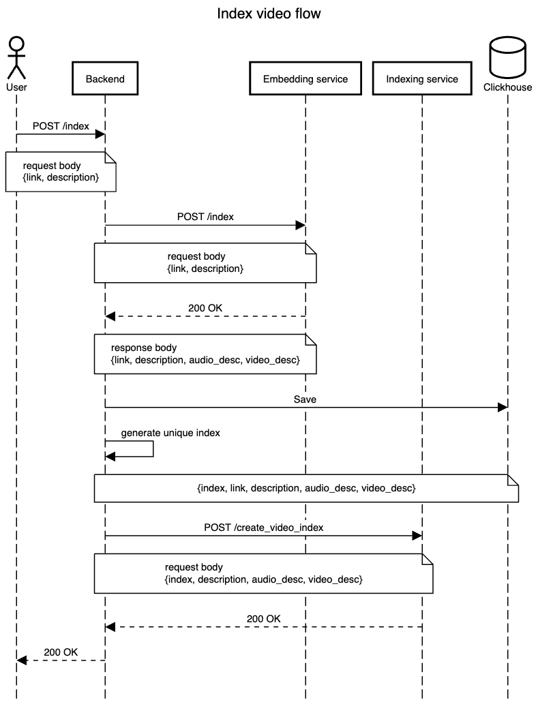
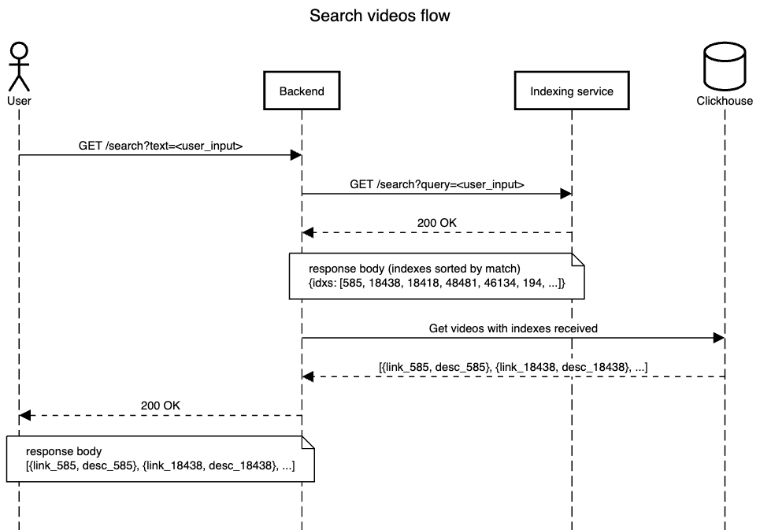

# Звездолет -- API для индексации и поиска видео

## Описание

Данное приложение является точкой входа для осуществления операций по индексации и поиску видео

## Используемые технологии

- API реализовано при помощи HTTP API фреймворка [Gin](https://github.com/gin-gonic/gin)
- Хранение мета-информации о видеороликах, в том числе текстовое представление видео- и аудиодорожек осуществляется
  в [Clickhouse](https://clickhouse.com/)

## Пакеты / Модули

- api - модуль обработки HTTP-запросов, осуществляет валидацию и трансформацию данных, основной модуль приложения
- db - модуль, описывающий интерфейс работы с хранилищем и реализующий этот интерфейс для SQL базы данных
- config - модуль для чтения, валидации и десериализации начальной конфигурации приложения, основан на
  библиотеке [Viper](https://github.com/spf13/viper)
- transform - вспомогательный пакет, содержащий функции для манипуляции данными.

## Зависимости

Приложения опирается на следующие зависимости:

- Clickhouse-server (см. "Схема базы данных")
- [Сервис индексации видео](https://github.com/lct-2024-video-ai-search/faiss_search_indexing)
- [Сервис извлечения признаков](https://github.com/lct-2024-video-ai-search/extracting_video_features)

Процесс индексации описан в следующей диаграмме последовательности:



Процесс поиска видео по тексту описан в следующей диаграмме последовательности:



## Схема базы данных

На данный момент в базе данных присутствует одна таблица

```sql
CREATE TABLE VideoIndex
(
    link String, -- ссылка на видеоролик
    audio_description String, -- расшифровка аудиодорожки из видео
    video_description String, -- расшифровка видеодорожки из видео
    idx UInt64, -- уникальный идентификатор видео в базе данных
    user_description String, -- пользовательское описание видео
    created_at DateTime DEFAULT now() -- время занесения записи в базу данных
)
Engine = MergeTree
PRIMARY KEY (idx)

```

## Точки доступа

По URI `/docs` доступен [Swagger UI](https://api-zvezdolet.ddns.net/docs/) с описанием API. Ниже приведены примеры
запросов

- `POST /index`
    - Request body:
      ```json
      {
         "link": "https://cdn-st.rutubelist.ru/media/46/b7/cefb2949499795da7827eca57a62/fhd.mp4",
          "description": "#мужчина #квадроцикл #дрифт"
      }
      ```
- `GET /search?text=баскетбол`

## Конфигурация и запуск

Для запуска требуется задать переменные окружения. Для удосбтва можно использовать файл `app.env`.

```
CLICKHOUSE_HOST=127.0.0.1:9000 # адрес Clickhouse (в целях удобства демонстрации, аутентификация на данный момент не производится)
VIDEO_PROCESSING_SERVICE_ADDRESS=http://localhost:4765 # адрес сервиса извлечения признаков
VIDEO_INDEXING_SERVICE_ADDRESS=http://localhost:8000 # адрес сервиса индексации видео
HTTP_SERVER_ADDRESS=0.0.0.0:8080 # адрес API
```

Если toolchain языка Go установлен, достаточно исполнить

```bash
go run main.go
```

или же воспользоваться Docker

```bash
docker-compose up -d
```

Приложение по умолчанию не создает и не валидирует схему БД. Нужно исполнить скрипт `init.sql` на рабочем инстансе
Clickhouse

```bash
clickhouse-client < init.sql
```

либо воспользоваться скриптом `start_docker.sh`

## Демонстрация

API развернуто и доступно по адресу https://api-zvezdolet.ddns.net/